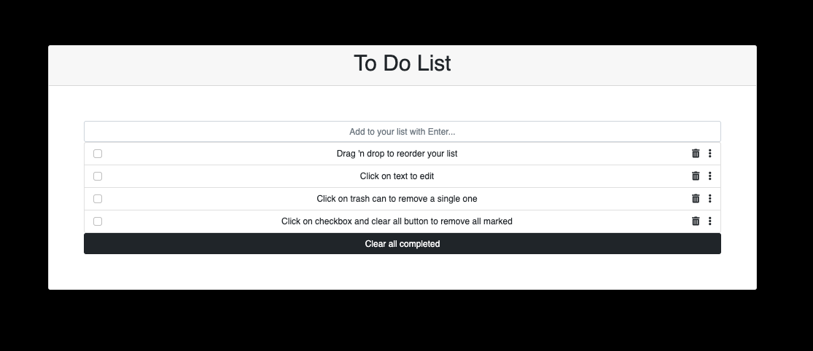

# Webpack - Form

> This is a project to create and a to do list with js using webpack!





## Live-version

https://afcastaneda223.github.io/webpack-form/dist/

## Built With

- HTML + CSS + Javascript

## Getting Started

* You will not need additional instructions on installing Prerequisites.
* In case you have node_modules on your folder Add them to .gitignore file before you a push.

### Prerequisites

* No prerequisites needed for this project.
 <!--
This is an example of how to list things you need to use the software and how to install them.
* npm
  ```sh
  npm install npm@latest -g
  ```
-->

### Installation
1. Clone the repo
   ```sh
   git clone git@github.com:afcastaneda223/webpack-form.git
   ```
2. Install NPM packages
   ```sh
   npm install
   ```
   2. Start the server 
   ```sh
   npm start
   ```
-->

## Author

👤 **Author**

**Andres Felipe Castañeda Ramos**
- Github: [@afcastaneda223](https://github.com/afcastaneda223)
- Twitter: [@afcastaneda](https://twitter.com/afcastaneda)
- Linkedin: [Andres Felipe Castañeda](www.linkedin.com/in/andres-castaneda223)


## 🤝 Contributing

Contributions, issues, and feature requests are welcome!

Feel free to check the [issues page](https://github.com/smunozmo/).


## 👋 Acknowledgements

My family

## Show your support

Give a ⭐️ if you like this project!
